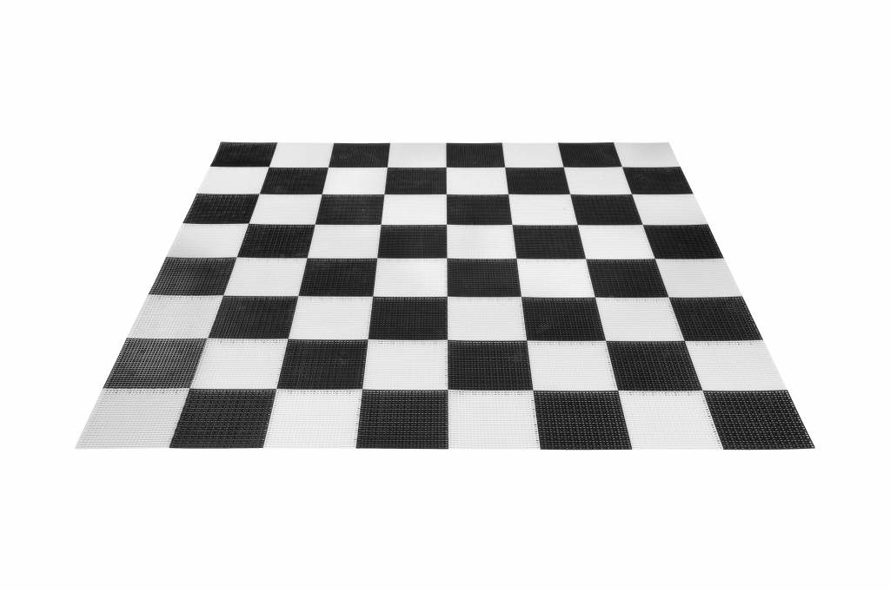

# under construction

Themen für attraktive, dynamische Inhalte sind
- Kalender für Terminverwaltung von Turnieren, Events etc.
- Ergebnislisten vergangener Turniere
- Bilder
- Linksammlung
- Mattprobleme, Partiestudien! hier bieten sich folgende Möglichkeiten, pgn files oder FEN strings einzustellen:

## PgnViewerJs
[Matthias-Francis 23.11.2017](pgnvjs095/examples/mf.html)

[DEBUGME](pgnvjs095/examples/aronian.html)

[PgnViewerJS config-builder](http://mliebelt.github.io/PgnViewerJS/docu/example/config.html)

## Chessbase (cbreplay)
[Matthias-Francis 23.11.2017](start.html)

