<link rel="shortcut icon" type="image/x-icon" href="favicon.ico">

# Aktuell

**9. Oktober 2023: Linus Meer auf Rang 3 des Zürichsee Grand Prix** 
**[Rangliste](http://www.schach-rj.ch/GP_AlbuVille/GP23_Schlussrangliste.pdf)**  
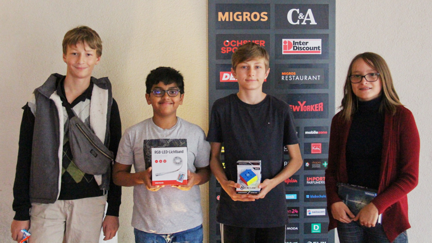 

**1. Oktober 2023: Emanuel Evangelovski gewinnt den Zürcher Jugendschachkönig** 
**[Rangliste](https://chess-results.com/tnr812932.aspx?lan=0&art=1&rd=7&fed=SUI&turdet=NO)**  
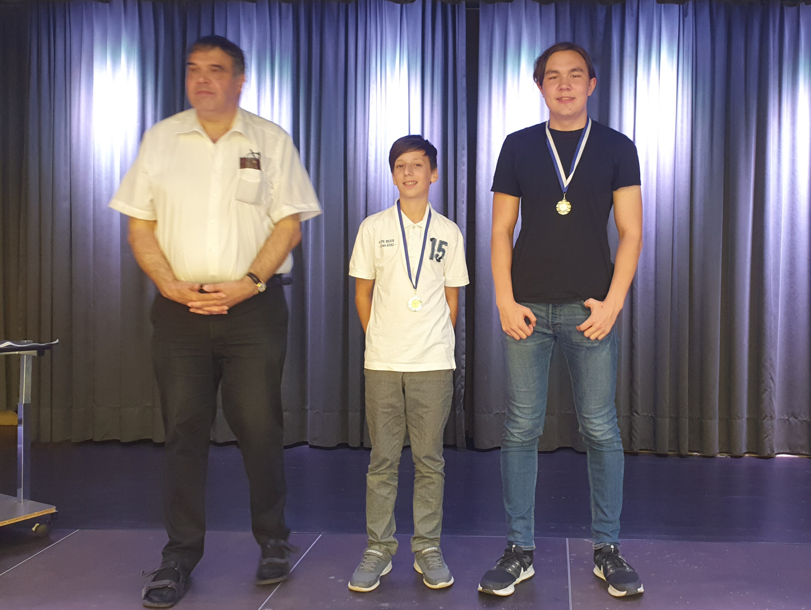 

***

**24. September 2023: Vivan Varghese gewinnt das 1. Qualifikationsturnier für die Schweizer Meisterschaft 2024 U10** 
**[Rangliste](https://chess-results.com/tnr809168.aspx?lan=0&art=1&rd=7)**  
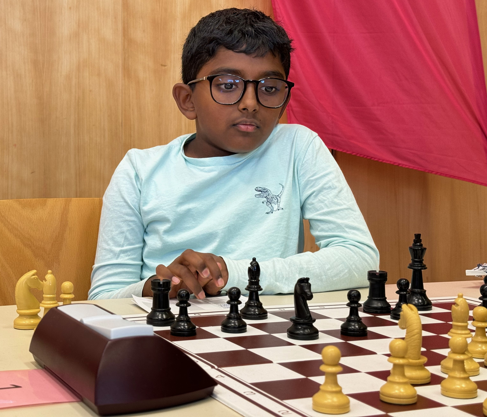  

***

**27. August 2023: Michael Seiler gewinnt das 5. Seebach Open 15+0 (Rapid)** 
**Rangliste & Fotostrecke:**
  

***

**18. Juni 2023: Open Air Mannschaftsblitzturnier** 
**Rangliste & Fotostrecke:**
  

***

**7. Mai 2023: Emanuel Angelovski gewinnt das 2. Seebach Open U16** 
**[Rangliste](https://chess-results.com/tnr756929.aspx?lan=1&art=1&rd=7&turdet=YES)**  
  

***

**23. März 2023: DreamTeam 1 macht den ZMM-Aufstieg in die Spielklasse Ia wahr.** 
[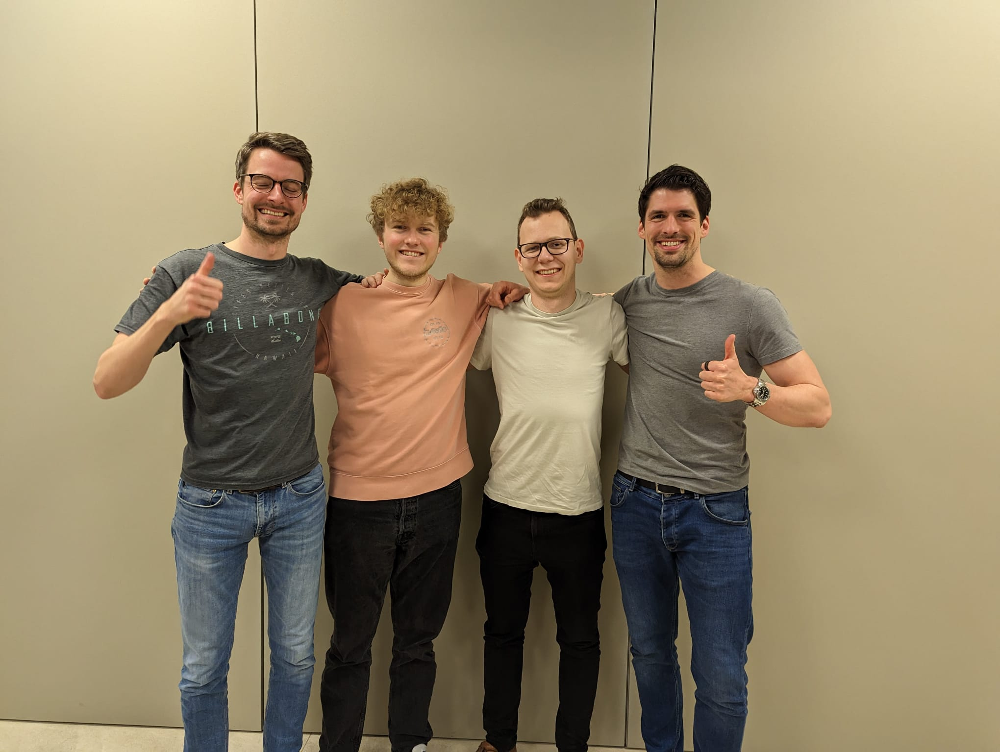](https://www.youtube.com/watch?v=1Pg1RguhqxY)

***

**15. Januar 2023: SC Seebach erfolgreich in der 3. Runde des Zürichsee Jugend Grand Prix** 
**[Bericht & Rangliste](https://www.svzs.ch/jugendschach/jugendgrand-prix-2022-23/182-3-runde-in-einsiedeln-rangliste-etc.html)**  
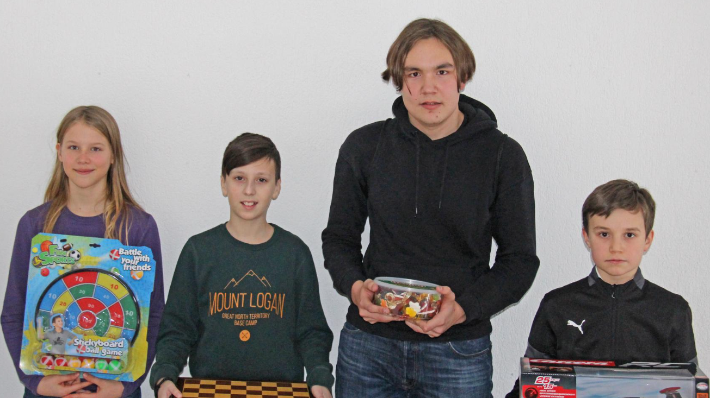  

***

**5. Dezember 2022: Weihnachtsfeier** 
**Fotostrecke:**
  

***

**13. November 2022: Timon Trubini gewinnt die 2. Runde des Zürichsee Jugend Grand Prix** 
**[Rangliste](Finalrangliste_JGP_2022 (1).pdf)**  
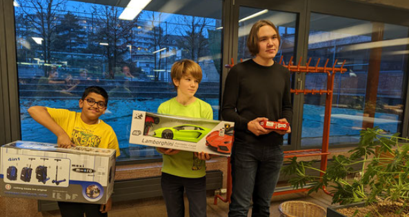  

***

**2. Oktober 2022: Jugendschachkönig des Zürcher Schachverbands** 
**[Rangliste](https://chess-results.com/tnr675345.aspx?lan=0&art=1&rd=7)**  
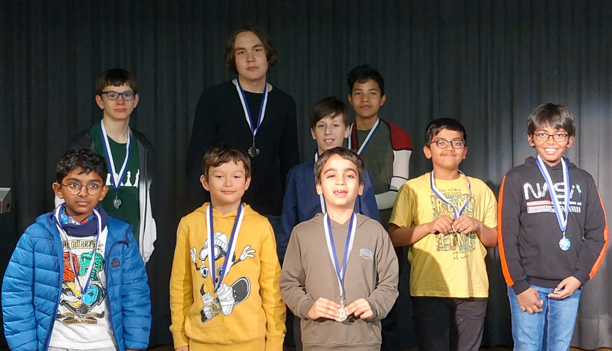  

***

**21.-23. September 2022: Zürcher Schachwoche** 
An einer weiteren Ausabe der Zürcher Schachwoche, an der sich 6 Zürcher Clubs in den Disziplinen Blitz, Simultan und klassischen Partien messen konnten, erzielten wir einen hervorragenden 4. Rang:
**[Resultate der ZSW 2022 (Rang: Spalte ganz rechts)](ZSW2022.html)**  

***

**28. August 2022: 4. Seebach Open 10+0 (Blitz)** 
Mit 67 Schachbegeisterten blieb die Teilnehmerzahl etwas unter den Erwartungen, dafür war die Startliste mit einem ELO-Durchschnitt der ersten fünf Angemeldeten mit 2'142 Punkten hochkarätig. 3 Generationen und Teilnehmer*innen aus über 20 Kulturkreisen kämpften tlw. verbissen um die Punkte. Lachen und gemütliches Zusammensein blieben trotzdem nicht auf der Strecke. Mit 17 Spielern, davon 9 Jungtalenten stellte unser Schachclub die grösste «Delegation». Mit 8 Punkten aus 9 Partien gewann Neumitglied Stefan Kunz aus Flawil vor den Zürcher Urgesteinen Robert Beer und Christoph Drechsler. Neumitglied Oliver Angst belegte mit 7. Punkten den undankbaren 4. Rang.
Nicht unerwähnt bleiben dürfen die sehr guten Resultate von Timon und Emanuel mit je 5.5 Punkten (2. und 3. der U12 Kategorie), der Turniereinstand von Felix (ebenfalls mit 5.5 Punkten) sowie die 5 Punkte von Marino und Tim.  
[Rangliste des 4. Seebach Open am 28.8.2022](http://chess-results.com/tnr668687.aspx?lan=1&art=1&rd=9)    

**Fotostrecke:**
[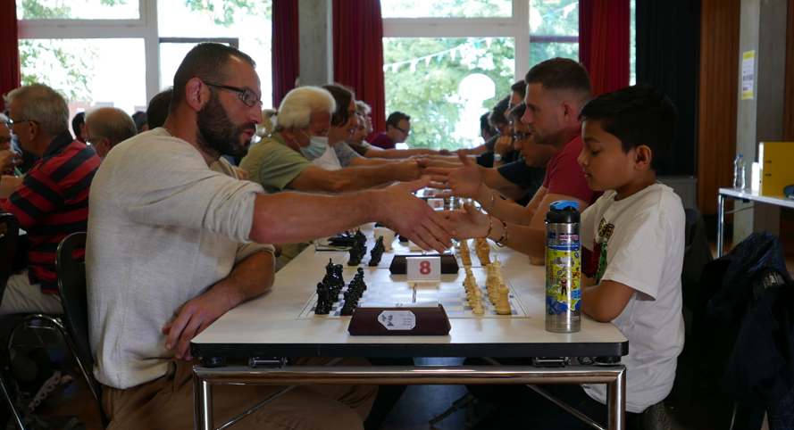](https://www.sc-seebach.ch/open_2022/test.html)  

***

**19. Juni 2022: 1. Open Air Mannschafts-Blitzturnier** 
Direkt am Katzenbach trafen sich 15 Mannschaften aus sechs Kantonen zum ersten Open Air
Mannschaftsblitzturnier des SC Seebach.  
Der gewählte Turniermodus mit sechs Vorrunden und dann Direktbegegnungen bis zum Final versprach, die Spannung bis zum Schluss zu steigern.
Als Favorit gestartet, setzte sich die Schachgesellschaft Zürich, von IM Anthony Petkidis knapp dank den besseren Brettpunkten gegen SC Brugg durch. 
Die Bronzemedaille gewann ASK Réti.  
Mit dem 6. Schlussrang feierte die 1. Mannschaft DieSchachSchulProfi einen Achtungserfolg.  
Beachtlich schlug sich ebenfalls der Zentralvorstand des Schweizerischen Schachbunds (8. Schlussrang).  
**[Rangliste & Fotostrecke](mannschaftshblitz/mannschaftsblitz.md)**   
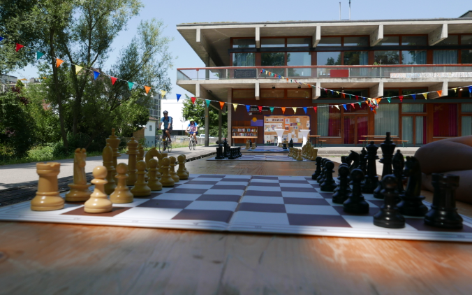  
 
***

**22. Mai 2022: 1. Seebach Open U16**   
Zum ersten mal konnten wir unser Open U16 durchführen. Eingeschrieben hatten sich 99 Schachtalente, schliesslich beendeten 74 Teilnehmende das Turnier. Rund 51 % der Teilnehmenden stammten aus der Kategorie U12, 27 % waren U8, nur 22 % U16. Gesamtsiege mit 7.5 Punkte wurde Malli Suvirr, vor den Punktengleichen Simon Schellenberg (Start-Nr. 1 mit 1917 ELO) und Anuar Turashbayev (1. U12). Kategorie-Sieger U8 wurde Marius Neuschild. Mit je 6 Punkten belegten Karthik und Emanuel die ausgezeichnete Ränge 15 und 16.
Wir danken allen Sponsoren, Helfern und Spielern.  
**[Rangliste](https://chess-results.com/tnr640694.aspx?lan=1&art=1&rd=9)**    

**Fotostrecke:**
[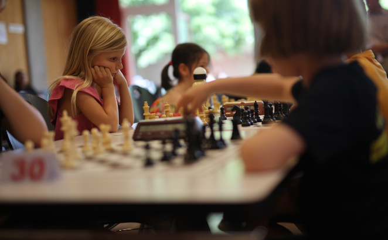](https://www.sc-seebach.ch/u16_2022/test.html)  

***

**7. November 2021: Jugendschachkönig des Zürcher Schachverbands** 
Grossartiger Erfolg unserer Jungtalente:  
**[Resultate U12](https://chess-results.com/tnr586249.aspx?lan=0&art=1&rd=7)**   
**[Resultate U18](https://chess-results.com/tnr586243.aspx?lan=0&art=1&rd=7)**  
   
  

***

# Wer sind wir

**Wir sind ein junger, bunter Schachclub in Zürich Seebach mit Spielern aus 30 Nationen.**    
**Wir spielen in den schweizerischen Mannschaftswettbewerben mit 2 Teams in der ZMM, 3 Teams in der SGM und 4 Teams in der SMM und organisieren mehrere offene Turniere.**   
**Jede\*r ist bei uns willkommen, auch Anfänger\*innen!**   

**Wir spielen Mittwochs ab 18 Uhr (Kinder-und Jugend 16-18 Uhr) im Mehrzwechraum der Badi Seebach siehe [Spiellokal](#spiellokal)
Neben freiem Spiel bieten wir an folgenden Terminen zusätzlich:**
* **am 1. Mittwoch des Monats:**   gemeinsames Menu serviert von unserem Starkoch Francis
* **am 2. & 4. Mittwoch des Monats:**   Vereinsmeisterschaft in  verschiedenen Turnierformaten, siehe [Turniere](#turniere)
* **am 3. Mittwoch des Monats:**   Theorielektionen zu verschiedenen Themen (Eröffnung, Endspiel, Strategie...)

**[Die Vereinsstatuten des SC Zürich Seebach](StatutenSCSeebach.pdf)**

  

***
# Medienspiegel 

**[How to beat a IM](/press/Busch.pdf)** 

**[SSZ 2/2023](/press/SSZ2_2023.pdf)** 

**[Tagblatt](/press/Tagblatt.pdf)** 

***

# Spiellokal
**Mittwochs ab 18:00 im Mehrzweckraum des Freibad Seebach** 
Nur 3 Minuten zu Fuss von der Haltestelle Zürich Seebach  

**Öffentliche Verkehrsmittel:**
Mit Tram 14 oder Bus 768 (vom Flughafen oder Oerlikon) bis Zürich Seebach (Endstation der Tram 14)

**Mit dem Auto:**
Hinter der Tramendstation ist ein grosser Parkplatz. (Navigationsgeräte: Katzenbachstr. 20, 8052 Zürich)
Die Parkplatzeinfahrt befindet sich von der Katzenbachstrasse kommend, unmittelbar nach dem Hotel Landhus rechts.  

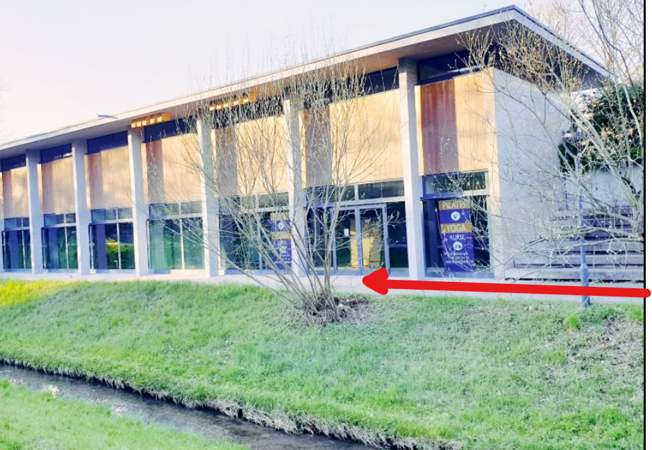  
  
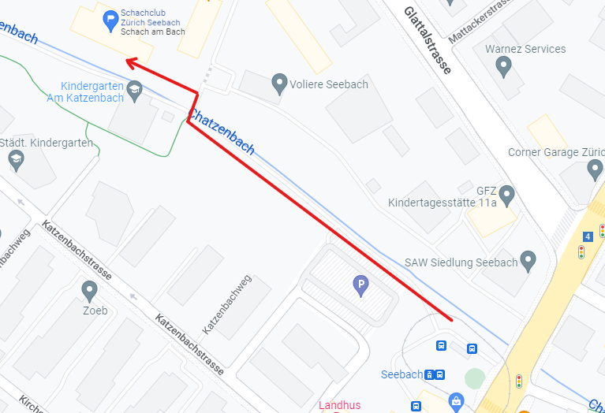  

***

# Kinder- und Jugendschach
**jeden Mittwoch (ausser Feiertage) 16-18 Uhr im Mehrzweckraum der Badi Seebach, siehe [Spiellokal](#spiellokal)  
Ob neugierige\*r Anfänger\*in oder ambitionierte\*r Turnierspieler\*in, unser Betreuungs-Team freut sich, mit Dir die Faszination des Schachspiels zu teilen. Die Teilnahme an unseren Schachtreffen ist kostenlos. Bist Du interessiert? Komm einfach vorbei zum Schnuppern oder ruf Andreas an (079 235 30 87)**
 

**Kontakt:**   Richard Bohnenberger  <bohnenbergerrichard@gmail.com>   079 443 56 72
 
 
**Unser Schachclub ist Mitglied der [VERSA](https://www.zss.ch/versa/verein), ein Verein zur Verhinderung sexueller Ausbeutung von Kindern im Sport – Eine Initiative des Zürcher Stadtverbandes für Sport (ZSS)**
 
 
**[Bericht zum Jugend-Simultan der Quartierzeitung Zürich Nord](EinerGegenAlle.pdf)**

***

# Mitgliedschaft
**Erwachsene:** 80 CHF/Jahr. Darin enthalten sind: Spielabende inkl. Vereinsmeisterschaft, Theorielektionen sowie die Teilnahme am jährlichen Weihnachtsessen und am Seebach Open / Seebach Open U16. Aktive Mitglieder mit SSB-Spielerlizenz bezahlen zusätzlich CHF 100 [Gebühren des SSB](https://www.swisschess.ch/beitraege-und-gebuehren.html)

**Kinder und Jugendliche:** Die Teilnahme an den Mittwochstrainings ist kostenfrei. Dank unserer Sponsoren und Gönner übernehmen wir auch die Kosten für die Spielerlizenzen des schweizerischen Schachbundes.

***

# Schach fasziniert uns, weil...
* **... es das Spiel der König*innen ist.**
* **... Schacheröffnungen so klangvolle Namen haben.** 
* **... der Rausch im Mittelspiel betörend ist.**
* **... es eine Lust ist, etwas kaputt zu machen.** 
* **... man im Schach lernt, Geräusche auszuhalten.** 
* **... Schach ohne Humor undenkbar ist.** 
* **... Magnus Carlsen zaubern kann.** 
* **... man im Schach seine Menschenkenntnis schult.** 
* **... im Schach Kinder und Erwachsene ebenbürtig gegeneinander kämpfen können.** 
* **... Schach nachweislich das Erinnerungsvermögen und die Geduld schult.**
* **... auch Weltmeister\*innen alberne Fehler machen.** 
* **... Schach und Fussball gut zusammenpassen.**  
* **... im Schach kein Problem schwierig genug sein kann.** 
* **... das erstickte Matt ein ästhetisches Vergnügen ist:**

<iframe width=600 height=371 src="https://lichess.org/study/embed/RIoyR5uO/F7LSLisD#0" frameborder=0></iframe>

***

# Zitate
***

* **« Chess is life in miniature. Chess is struggle, chess is battles. »**     *GARRY KASPAROV*

***

* **« Chess is everything: art, science and sport. »**     *ANATOLY KARPOV*

***

* **« Life like chess is about knowing to do the right move at the right time. »**     *KALEB RIVERA*

***

* **« Du musst Deinen Gegner in einen tiefen dunklen Wald führen wo 2+2=5 ist und wo der Weg, der wieder hinausführt, nur breit genug für einen ist. »**     *MICHAIL TAL (1936-1992)*

***

* **« Der gute Spieler hat immer Glück. »**     *JOSÉ RAOUL CAPABLANCA (1888-1942)*

***

* **« Im Schach, wie im Leben, ist der Mensch sich selbst der gefährlichste
Widersacher. »**     *WASSILIJ WASSILJEWITSCH SMYSLOW (1923-2010)*

***

* **« Security is mostly a superstition. It does not exist in nature, nor do the children of men as a whole experience it. Avoiding danger is no safer in the long run than outright exposure. Life is either a daring adventure, or nothing. »**     *HELEN KELLER (1880-1968)*

***

* **« Ever tried. Ever failed. No matter. Try again. Fail again. Fail better. »**      *SAMUEL BECKETT (1906-1998)* 

***

# Vorstand
* **Präsident**   Andreas Poncini   <andreas.poncini@ponciniconsulting.ch>   079 235 30 87

* **Vize-Präsident, Leiter Aus- und Weiterbildung**   Felix Busch    <busch.felix@gmail.com>  

* **Vize-Präsident, Leiter Technische Kommission**   Livio Sgier     
 
* **Kinder- & Jugendschach**   Richard Bohnenberger   <bohnenbergerrichard@gmail.com>   079 443 56 72

* **Kinder- & Jugendschach, Turnierschach**   Marino Gambarara   <marino.gambarara@bluewin.ch>

* **Leiter Gastronomie**   Adrian Götz  

* **IT & Web Content**   Matthias Lobmayer   <matthias.lobmayer@gmail.com>

* **Postadresse**  
Schachclub Zürich Seebach  
c/o Andreas Poncini  
Kirchenfeld 75  
8052 Zürich  

***

# Kalender
Termine des Schweizerischen Schachbunds: [Turnierkalender des SSB](http://www.swisschess.ch/kalender.html)   
  
<iframe src="https://calendar.google.com/calendar/embed?height=400&amp;wkst=2&amp;bgcolor=%23ffffff&amp;ctz=Europe%2FZurich&amp;src=ZDJjN3BsY2xhdXA3cXByOGU4ZzN2NGtjYjBAZ3JvdXAuY2FsZW5kYXIuZ29vZ2xlLmNvbQ&amp;color=%23C0CA33&amp;showTitle=0&amp;showNav=1&amp;showPrint=0&amp;showTabs=1&amp;showCalendars=0&amp;showTz=1&amp;showDate=1&amp;hl=de" style="border:solid 1px #777" width="600" height="400" frameborder="0" scrolling="no"></iframe>

***

# Turniere

***

## Zur Zeit laufende Turniere
**SGM 2023/24:**  
**[Spielplan](https://test01.swisschess.ch/turniere/sgm/2024/sgm2024.pdf)**  
**ZMM 2023/24:**  
[Seebach 1](https://chess-results.com/tnr827699.aspx?lan=0&art=0&turdet=YES) / [Seebach 2](https://chess-results.com/tnr827710.aspx?lan=0&art=0&turdet=YES)  

***

## Turniere demnächst
[Turniere des **SSB**](https://www.swisschess.ch/turniere.html)  

***

## Turnier-Archiv
[Rangliste des 1. Seebach Open am 18.8.2019](Schlussrangliste SeebacherSchachturnier.pdf)  
[Rangliste des 2. Seebach Open am 16.8.2020](SeebachOpen2020.pdf) 
[Rangliste des 3. Seebach Open am 29.8.2021](RanglisteSeebachOpen2021.pdf) 
[Rangliste des 1. Seebach Open U16 am 22.5.2022](https://chess-results.com/tnr640694.aspx?lan=1&art=1&rd=9)    
[Rangliste des 4. Seebach Open am 28.8.2022](http://chess-results.com/tnr668687.aspx?lan=1&art=1&rd=9)   
[Rangliste des 2. Seebach Open U16 am 7.5.2023](https://chess-results.com/tnr756929.aspx?lan=1&art=1&rd=7&turdet=YES)  
[Rangliste des 5. Seebach Open am 27.8.2023](https://chess-results.com/tnr809253.aspx?lan=0&art=1&rd=7)   

**SGM 2022:** [Spielplan](https://www.swisschess.ch/tl_files/ssb/news/sgm/sgm2022.pdf) / [Resultate Seebach 1](https://www.swisschess.ch/sgm.html?old=L3R1cm5pZXJlL3NnbS5waHA_YWphaHI9MjAyMiZhZ3J1cHBlPTUxMCZhbGlnYT01JmFyb3VuZD0x) / [Resultate Seebach 2](https://www.swisschess.ch/sgm.html?old=L3R1cm5pZXJlL3NnbS5waHA_YWphaHI9MjAyMiZhbGlnYT01JmFncnVwcGU9NTExJmFyb3VuZD0x)  
**SMM 2022:** [Spielplan](https://test01.swisschess.ch/turniere/smm/2022/smmspielplan2022.pdf) / [Resultate Seebach 1](http://adapter-neu.swisschess.ch/turniere/smm.php?ajahr=2022&agruppe=504&aliga=5) / [Resultate Seebach 2](http://adapter-neu.swisschess.ch/turniere/smm.php?ajahr=2022&agruppe=605&aliga=6)  
**SGM 2022/23:** [Spielplan](https://test01.swisschess.ch/turniere/sgm/2023/sgm2023.pdf)  / [Resultate Seebach 1](http://adapter-neu.swisschess.ch/turniere/sgm.php?ajahr=2023&agruppe=512&aliga=5) / [Resultate Seebach 2](http://adapter-neu.swisschess.ch/turniere/sgm.php?ajahr=2023&agruppe=511&aliga=5) / [Resultate Seebach 3](http://adapter-neu.swisschess.ch/turniere/sgm.php?ajahr=2023&agruppe=510&aliga=5)  
**ZMM 2022/23:** [Seebach 1](https://chess-results.com/tnr681776.aspx?lan=0&art=2) / [Seebach 2](https://chess-results.com/tnr681777.aspx?lan=0&art=2)  
**SMM 2023:** [Seebach 1](http://adapter-neu.swisschess.ch/turniere/smm.php?ajahr=2023&agruppe=504&aliga=5) / [Seebach 2](http://adapter-neu.swisschess.ch/turniere/smm.php?ajahr=2023&agruppe=607&aliga=6) / [Seebach 3](http://adapter-neu.swisschess.ch/turniere/smm.php?ajahr=2023&agruppe=604&aliga=6) / [Seebach 4](http://adapter-neu.swisschess.ch/turniere/smm.php?ajahr=2023&agruppe=605&aliga=6) /

***

## Reglemente
[Reglement für das **Seebach Open**](SeebachOpenReglement.pdf)  
[Reglemente des **SSB**](http://www.swisschess.ch/reglemente.html) 

***

# Weblinks

[Schweizerischer Schachbund **SSB**](http://www.swisschess.ch/home-de.html)

[SSB on chess.com](https://www.chess.com/club/swiss-chess-federation)

[ELO Rechner](https://www.swisschess.ch/elo-kalkulator.html)

[Zürcher Schachverband **ZSV**](https://www.zuercherschachverband.ch)

[online Schach Shop Schweiz **chesspoint.ch**](https://www.chesspoint.ch/)

[Schachregeln für Anfänger **lichess.org/learn**](https://lichess.org/learn#/)

