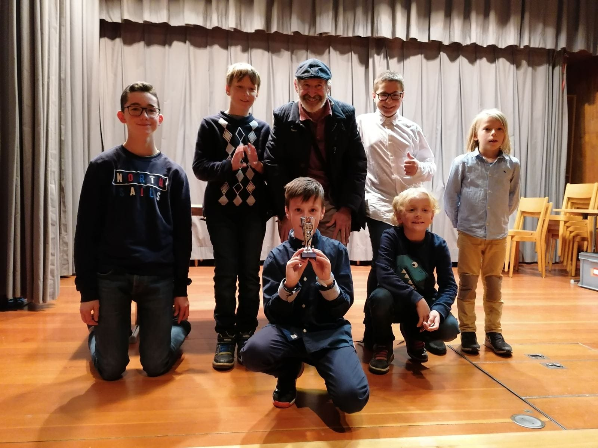
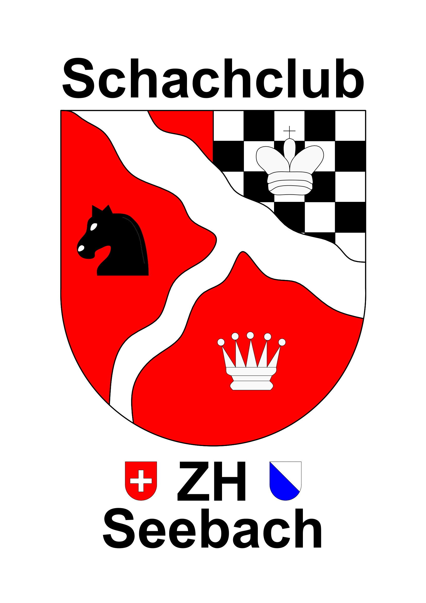

<link rel="shortcut icon" type="image/x-icon" href="favicon.ico">

# Aktuell

**Wir freuen uns auf die erste Auflage des Seebach Open UI16 am Sonntag 22. Mai im [GZ Seebach](https://gz-zh.ch/gz-seebach/)**

Anwesenheitskontrolle: bis 12 Uhr  
Spielbeginn: 12:15    
9 Runden Schweizer System  
Bedenkzeit: 10 min  
Sonderwertungen: U8, U12, U16  
3 Pokale je Altersklasse und Sachpreise  
Überraschungsgeschenk für alle Teilnehmer*innen  
In den Pausen grosser Torwand-Wettbewerb!    

**[Ausschreibung Seebach Open U16](AusschreibungJugend2022.pdf)**    

**Grossartiger Erfolg unserer Talente beim Turnier "Jugendschachkönig" des Zürcher Schachverbands:**
[Resultate U12](https://chess-results.com/tnr586249.aspx?lan=0&art=1&rd=7) / [Resultate U18](https://chess-results.com/tnr586243.aspx?lan=0&art=1&rd=7)  

 
***

# Wer wir sind

**Wir sind ein junger, bunter Schachclub in Zürich Seebach mit Spielern aus 30 Nationen.**    
**Wir spielen mit je 2 Teams in den schweizerischen Mannschaftswettbewerben (SMM, SGM, ZMM) und organisieren offene Turniere.**   
**Jede\*r ist bei uns willkommen, auch Anfänger\*innen!**   

**[Die Vereinsstatuten des SC Zürich Seebach](StatutenSCSeebach.pdf)**

# Mitgliedschaft
**Erwachsene:** 80 CHF/Jahr. Darin enthalten sind: Spielabende inkl. Vereinsmeisterschaft, Theorielektionen sowie die Teilnahme am jährlichen Weihnachtsessen und am Seebach Open. Aktive Mitglieder mit SSB-Spielerlizenz bezahlen zusätzlich CHF 100 [Gebühren des SSB](https://www.swisschess.ch/beitraege-und-gebuehren.html)

**Kinder und Jugendliche:** Die Teilnahme an den Mittwochstrainings ist kostenfrei. Dank unserer Sponsoren und Gönner übernehmen wir auch die Kosten für die Spielerlizenzen des schweizerischen Schachbundes.

***

# Spielabend
**Montags ab 18:30 im CaféAmBach des [GZ Seebach](https://gz-zh.ch/gz-seebach/)** 
**Neben freiem Spiel bieten wir an folgenden Terminen zusätzlich:**
* **am 1. Montag des Monats:**   gemeinsames Menu serviert von unseren Starköchen Simon und Francis
* **am 2. & 4. Montag des Monats:**   Vereinsmeisterschaft in  verschiedenen Turnierformaten, siehe [Turniere](#turniere)
* **am 3. Montag des Monats:**   Theorielektionen zu verschiedenen Themen (Eröffnung, Endspiel, Strategie...)

<iframe src="https://www.google.com/maps/embed?pb=!1m18!1m12!1m3!1d2699.355604057431!2d8.542197644127354!3d47.42450899316742!2m3!1f0!2f0!3f0!3m2!1i1024!2i768!4f13.1!3m3!1m2!1s0x47900befc7371097%3A0x3603d9d75790c6d3!2sSchach%20am%20Bach!5e0!3m2!1sde!2sch!4v1623650982664!5m2!1sde!2sch" width="600" height="450" style="border:0;" allowfullscreen="" loading="lazy"></iframe>

***

# Kinder- und Jugendschach
**jeden Mittwoch (ausser Feiertage) 16-18 Uhr im [GZ Seebach](https://gz-zh.ch/gz-seebach/)  
Ob neugierige\*r Anfänger\*in oder ambitionierte\*r Turnierspieler\*in, unser Betreuungs-Team freut sich, mit Dir die Faszination des Schachspiels zu teilen. Die Teilnahme an unseren Schachtreffen ist kostenlos. Bist Du interessiert? Komm einfach vorbei zum Schnuppern oder ruf Andreas an (079 235 30 87)**
 

**Kontakt:**   Richard Bohnenberger  <bohnenbergerrichard@gmail.com>   079 443 56 72
 
 
**Unser Schachclub ist Mitglied der [VERSA](https://www.zss.ch/versa/verein), ein Verein zur Verhinderung sexueller Ausbeutung von Kindern im Sport – Eine Initiative des Zürcher Stadtverbandes für Sport (ZSS)**
 
 
**[Bericht zum Jugend-Simultan der Quartierzeitung Zürich Nord](EinerGegenAlle.pdf)**

**[Seebach Open U16 am 22.5.2022](AusschreibungJugend2022.pdf)**

***

# Schach fasziniert uns, weil...
* **... es das Spiel der König*innen ist.**
* **... Schacheröffnungen so klangvolle Namen haben.** 
* **... der Rausch im Mittelspiel betörend ist.**
* **... es eine Lust ist, etwas kaputt zu machen.** 
* **... man im Schach lernt, Geräusche auszuhalten.** 
* **... Schach ohne Humor undenkbar ist.** 
* **... Magnus Carlsen zaubern kann.** 
* **... man im Schach seine Menschenkenntnis schult.** 
* **... im Schach Kinder und Erwachsene ebenbürtig gegeneinander kämpfen können.** 
* **... Schach nachweislich das Erinnerungsvermögen und die Geduld schult.**
* **... auch Weltmeister\*innen alberne Fehler machen.** 
* **... Schach und Fussball gut zusammenpassen.**  
* **... im Schach kein Problem schwierig genug sein kann.** 
* **... das erstickte Matt ein ästhetisches Vergnügen ist:**

<iframe width=600 height=371 src="https://lichess.org/study/embed/RIoyR5uO/F7LSLisD#0" frameborder=0></iframe>

***

# Zitate
***

* **« Chess is life in miniature. Chess is struggle, chess is battles. »**     *GARRY KASPAROV*

***

* **« Chess is everything: art, science and sport. »**     *ANATOLY KARPOV*

***

* **« Life like chess is about knowing to do the right move at the right time. »**     *KALEB RIVERA*

***

* **« Du musst Deinen Gegner in einen tiefen dunklen Wald führen wo 2+2=5 ist und wo der Weg, der wieder hinausführt, nur breit genug für einen ist. »**     *MICHAIL TAL (1936-1992)*

***

* **« Der gute Spieler hat immer Glück. »**     *JOSÉ RAOUL CAPABLANCA (1888-1942)*

***

* **« Im Schach, wie im Leben, ist der Mensch sich selbst der gefährlichste
Widersacher. »**     *WASSILIJ WASSILJEWITSCH SMYSLOW (1923-2010)*

***

* **« Security is mostly a superstition. It does not exist in nature, nor do the children of men as a whole experience it. Avoiding danger is no safer in the long run than outright exposure. Life is either a daring adventure, or nothing. »**     *HELEN KELLER (1880-1968)*

***

* **« Ever tried. Ever failed. No matter. Try again. Fail again. Fail better. »**      *SAMUEL BECKETT (1906-1998)* 

***

# Vorstand
* **Präsident**   Andreas Poncini   <andreas.poncini@ponciniconsulting.ch>   079 235 30 87
 
* **Kinder- & Jugendschach**   Richard Bohnenberger   <bohnenbergerrichard@gmail.com>   079 443 56 72

* **Spielleiter**   Livio Sgier   <livio.sgier@gmail.com>

* **Finanzen**   Tim Bellmann

* **IT & Web Content**   Matthias Lobmayer   <matthias.lobmayer@gmail.com>

* **Postadresse**  
Schachclub Zürich Seebach  
c/o Andreas Poncini  
Kirchenfeld 75  
8052 Zürich  

***

# Kalender
hier finden sich u.a. Termine wie die des [SMM Spielplan](http://test01.swisschess.ch/turniere/smm/2021/smmspielplan2021.pdf)   
  
Termine des Schweizerischen Schachbunds: [Turnierkalender des SSB](http://www.swisschess.ch/kalender.html)   
  
<iframe src="https://calendar.google.com/calendar/embed?height=400&amp;wkst=2&amp;bgcolor=%23ffffff&amp;ctz=Europe%2FZurich&amp;src=ZDJjN3BsY2xhdXA3cXByOGU4ZzN2NGtjYjBAZ3JvdXAuY2FsZW5kYXIuZ29vZ2xlLmNvbQ&amp;color=%23C0CA33&amp;showTitle=0&amp;showNav=1&amp;showPrint=0&amp;showTabs=1&amp;showCalendars=0&amp;showTz=1&amp;showDate=1&amp;hl=de" style="border:solid 1px #777" width="600" height="400" frameborder="0" scrolling="no"></iframe>

***

# Turniere

[Reglement für das **Seebach Open**](SeebachOpenReglement.pdf) 
[Rangliste des 1. Seebach Open am 18.8.2019](Schlussrangliste SeebacherSchachturnier.pdf) 
[Rangliste des 2. Seebach Open am 16.8.2020](SeebachOpen2020.pdf) 
[Rangliste des 3. Seebach Open am 29.8.2021](RanglisteSeebachOpen2021.pdf) 

[Ausschreibung: **1. Seebach Open U16** am 22.5.2022](AusschreibungJugend2022.pdf) 
[Ausschreibung: **4. Seebach Open** am 28.8.2022](https://www.sc-seebach.ch/Ausschreibung2022.pdf) 

[Reglemente des **SSB**](http://www.swisschess.ch/reglemente.html) 
**SGM 2022:** [Spielplan](https://www.swisschess.ch/tl_files/ssb/news/sgm/sgm2022.pdf) / [Resultate Seebach 1](https://www.swisschess.ch/sgm.html?old=L3R1cm5pZXJlL3NnbS5waHA_YWphaHI9MjAyMiZhZ3J1cHBlPTUxMCZhbGlnYT01JmFyb3VuZD0x) / [Resultate Seebach 2](https://www.swisschess.ch/sgm.html?old=L3R1cm5pZXJlL3NnbS5waHA_YWphaHI9MjAyMiZhbGlnYT01JmFncnVwcGU9NTExJmFyb3VuZD0x)  
**SMM 2022:** [Spielplan](https://test01.swisschess.ch/turniere/smm/2022/smmspielplan2022.pdf) / [Resultate Seebach 1](https://www.swisschess.ch/smm.html?old=L3R1cm5pZXJlL3NtbS5waHA_YWphaHI9MjAyMiZhZ3J1cHBlPTUwNCZhbGlnYT01JmFyb3VuZD0w) / [Resultate Seebach 2](https://www.swisschess.ch/smm.html?old=L3R1cm5pZXJlL3NtbS5waHA_YWphaHI9MjAyMiZhZ3J1cHBlPTYwNSZhbGlnYT02JmFyb3VuZD0w)

**Vereinsmeisterschaft 2022:** [Ausschreibung](AusschreibungVM2022.pdf) / [Reglement](ReglementVM2022.pdf)

***

# Weblinks

[Schweizerischer Schachbund **SSB**](http://www.swisschess.ch/home-de.html)

[Zürcher Schachverband **ZSV**](https://www.zuercherschachverband.ch)

[online Schach Shop Schweiz **chesspoint.ch**](https://www.chesspoint.ch/)

[Schachregeln für Anfänger **lichess.org/learn**](https://lichess.org/learn#/)

